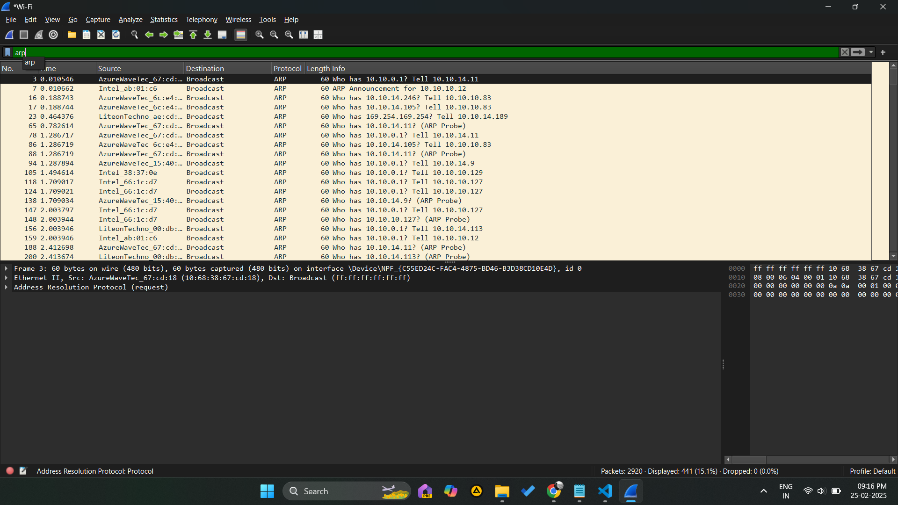
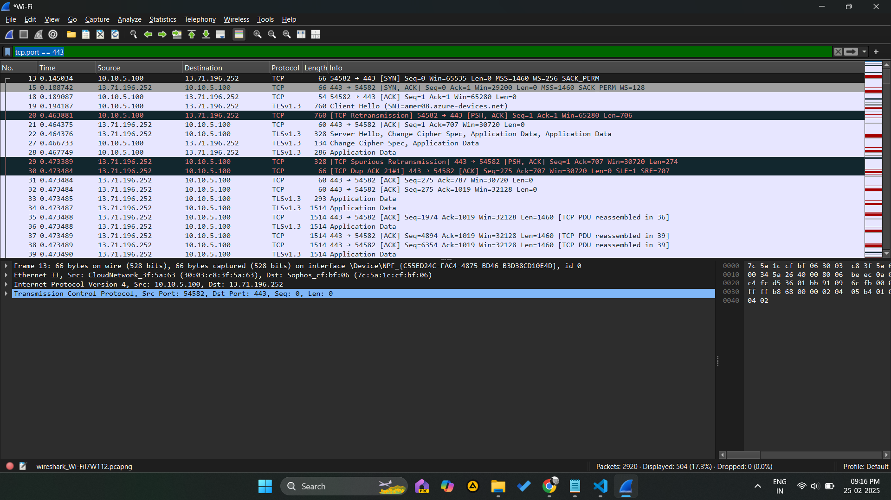
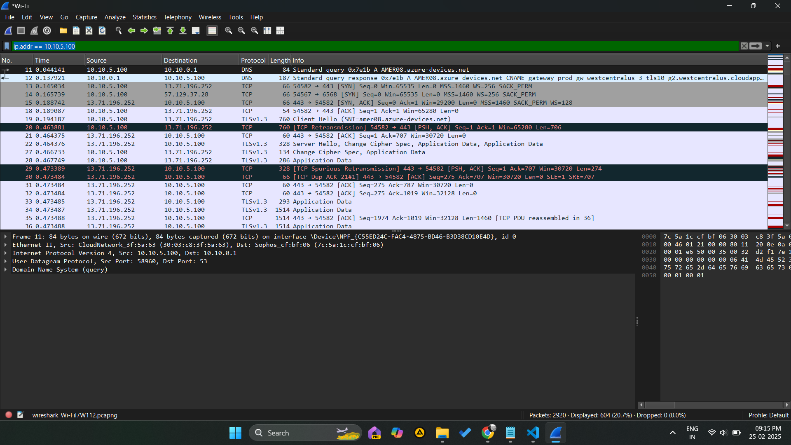
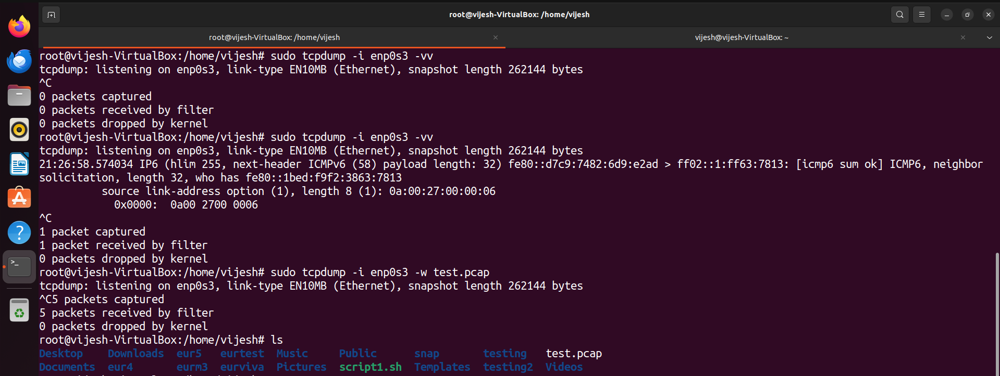
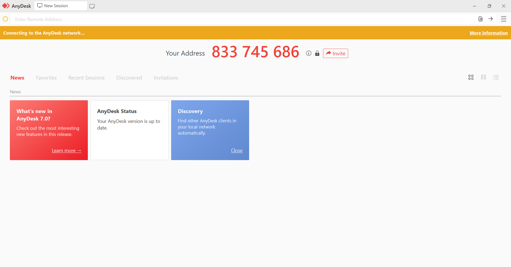
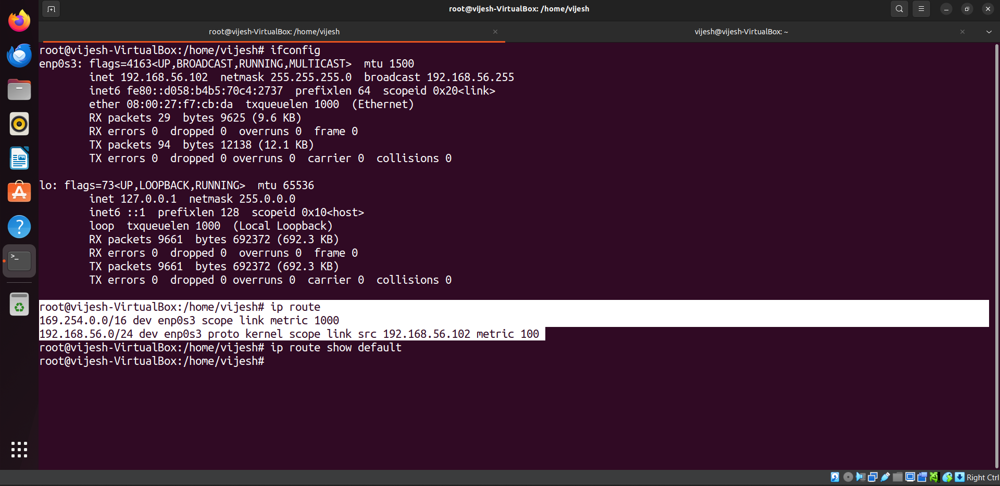
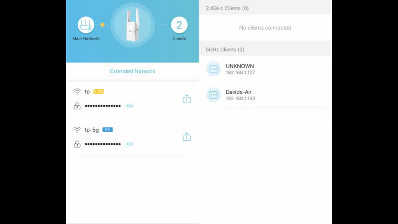
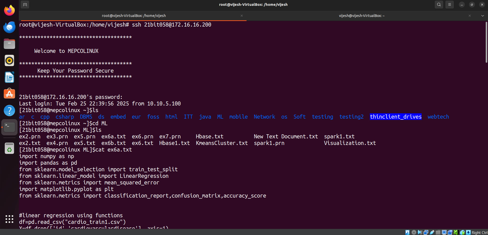

<h1>Networking Training - Module 1 & 2 Assignment </h1>

# Q1. Consider a case, a folder has multiple files and how would copy it to destination machine path 

## 1. SCP Command
For this setup, I am using my college's machine as remote machine and my laptop as local machine.
### Local Computer Log

```plaintext
vijesh@vijesh-VirtualBox:~$ ls
Desktop  Documents  Downloads  eur4  eur5  eurm3  eurtest  eurviva  Music  Pictures  Public  script1.sh  snap  Templates  testing  Videos
vijesh@vijesh-VirtualBox:~$ ls -lrt testing/
total 20
-rwxrwxrwx 1 vijesh vijesh 256 Feb  3 11:31 myscript.sh
-rw-rw-r-- 1 vijesh vijesh   6 Feb 25 10:05 file1
-rw-rw-r-- 1 vijesh vijesh   6 Feb 25 10:05 file2
-rw-rw-r-- 1 vijesh vijesh   6 Feb 25 10:05 file3
-rw-rw-r-- 1 vijesh vijesh   6 Feb 25 10:06 file4
vijesh@vijesh-VirtualBox:~$ scp -r testing/ 21bit058@172.16.16.200:/run/media/root/Data/student/it/ug/it2021/21bit058 

*************************************

     Welcome to MEPCOLINUX

*************************************
      Keep Your Password Secure
*************************************


21bit058@172.16.16.200's password: 
file4                                                                                                                 100%    6     0.5KB/s   00:00    
myscript.sh                                                                                                           100%  256    25.1KB/s   00:00    
file3                                                                                                                 100%    6     0.7KB/s   00:00    
file1                                                                                                                 100%    6     1.8KB/s   00:00    
file2                   

```

### Remote Computer Log (After Files Are Sent)

```plaintext
[21bit058@mepcolinux ~]$ls
ar  c  cpp  csharp  DBMS  ds  embed  eur  foss  html  ITT  java  ML  mobile  Network  os  Soft  testing  thinclient_drives  webtech
[21bit058@mepcolinux ~]$ls -lrt testing
total 20
-rw-r--r--. 1 21bit058 it-ug-2021   6 Feb 25 10:20 file4
-rwxr-xr-x. 1 21bit058 it-ug-2021 256 Feb 25 10:20 myscript.sh
-rw-r--r--. 1 21bit058 it-ug-2021   6 Feb 25 10:20 file3
-rw-r--r--. 1 21bit058 it-ug-2021   6 Feb 25 10:20 file1
-rw-r--r--. 1 21bit058 it-ug-2021   6 Feb 25 10:20 file2
[21bit058@mepcolinux ~]$cd testing
[21bit058@mepcolinux testing]$cat file3
Hello

```

## 2. RSYNC Command
It can also be used to send the files to remote machine. Also, for this setup, I am using my college's machine as remote machine and my laptop as local machine.

### Local Computer Log

```plaintext
vijesh@vijesh-VirtualBox:~$ ls
Desktop  Documents  Downloads  eur4  eur5  eurm3  eurtest  eurviva  Music  Pictures  Public  script1.sh  snap  Templates  testing  testing2  Videos
vijesh@vijesh-VirtualBox:~$ ls -lrt testing2
total 20
-rw-rw-r-- 1 vijesh vijesh   6 Feb 25 10:14 file1
-rwxrwxr-x 1 vijesh vijesh 256 Feb 25 10:14 myscript.sh
-rw-rw-r-- 1 vijesh vijesh   6 Feb 25 10:14 file2
-rw-rw-r-- 1 vijesh vijesh   6 Feb 25 10:14 file4
-rw-rw-r-- 1 vijesh vijesh   6 Feb 25 10:14 file3
vijesh@vijesh-VirtualBox:~$ rsync -avz testing2/ 21bit058@172.16.16.200:/run/media/root/Data/student/it/ug/it2021/21bit058/testing2 

*************************************

     Welcome to MEPCOLINUX

*************************************
      Keep Your Password Secure
*************************************


21bit058@172.16.16.200's password: 
sending incremental file list
created directory /run/media/root/Data/student/it/ug/it2021/21bit058/testing2
./
file1
file2
file3
file4
myscript.sh

sent 565 bytes  received 196 bytes  138.36 bytes/sec
total size is 280  speedup is 0.37


```

### Remote computer log (After files are sent):

```plaintext
[21bit058@mepcolinux ~]$ls
ar  c  cpp  csharp  DBMS  ds  embed  eur  foss  html  ITT  java  ML  mobile  Network  os  Soft  testing  testing2  thinclient_drives  webtech
[21bit058@mepcolinux ~]$ls -lrt testing2
total 20
-rw-rw-r--. 1 21bit058 it-ug-2021   6 Feb 25 10:14 file1
-rwxrwxr-x. 1 21bit058 it-ug-2021 256 Feb 25 10:14 myscript.sh
-rw-rw-r--. 1 21bit058 it-ug-2021   6 Feb 25 10:14 file2
-rw-rw-r--. 1 21bit058 it-ug-2021   6 Feb 25 10:14 file4
-rw-rw-r--. 1 21bit058 it-ug-2021   6 Feb 25 10:14 file3
[21bit058@mepcolinux ~]$cd testing2
[21bit058@mepcolinux testing2]$cat file2
Hello

```

# Q2. Host a FTP and SFTP server and try PUT and GET operations.
## 1. FTP:
For this setup, I am using Ubuntu Linux as server and my Windows System as client.

### SETUP:

```plaintext
root@vijesh-VirtualBox:/home/vijesh# sudo apt install vsftpd -y
Reading package lists... Done
Building dependency tree... Done
Reading state information... Done
vsftpd is already the newest version (3.0.5-0ubuntu1).
0 upgraded, 0 newly installed, 0 to remove and 70 not upgraded.
root@vijesh-VirtualBox:/home/vijesh# sudo nano /etc/vsftpd.conf
root@vijesh-VirtualBox:/home/vijesh# sudo systemctl restart vsftpd
root@vijesh-VirtualBox:/home/vijesh# sudo systemctl enable vsftpd
Synchronizing state of vsftpd.service with SysV service script with /lib/systemd/systemd-sysv-install.
Executing: /lib/systemd/systemd-sysv-install enable vsftpd
root@vijesh-VirtualBox:/home/vijesh# sudo systemctl status vsftpd
● vsftpd.service - vsftpd FTP server
     Loaded: loaded (/lib/systemd/system/vsftpd.service; enabled; vendor preset: enabled)
     Active: active (running) since Tue 2025-02-25 12:35:15 IST; 1min 20s ago
   Main PID: 4687 (vsftpd)
      Tasks: 1 (limit: 2271)
     Memory: 1.0M
        CPU: 22ms
     CGroup: /system.slice/vsftpd.service
             └─4687 /usr/sbin/vsftpd /etc/vsftpd.conf

Feb 25 12:35:15 vijesh-VirtualBox systemd[1]: Starting vsftpd FTP server...
Feb 25 12:35:15 vijesh-VirtualBox systemd[1]: Started vsftpd FTP server.

```

### Client PUT and GET:
```plaintext
C:\Users\Vijesh Pethuram K>ftp 192.168.56.102
Connected to 192.168.56.102.
220 (vsFTPd 3.0.5)
200 Always in UTF8 mode.
User (192.168.56.102:(none)): ftpuser
331 Please specify the password.
Password:
230 Login successful.
ftp> ls
200 PORT command successful. Consider using PASV.
150 Here comes the directory listing.
226 Directory send OK.
ftp> put "C:\Users\Vijesh Pethuram K\Downloads\eUR\file.txt"
200 PORT command successful. Consider using PASV.
150 Ok to send data.
226 Transfer complete.
ftp: 35 bytes sent in 0.00Seconds 35.00Kbytes/sec.
ftp> get hello.txt
200 PORT command successful. Consider using PASV.
150 Opening BINARY mode data connection for hello.txt (48 bytes).
226 Transfer complete.
ftp: 48 bytes received in 0.00Seconds 48000.00Kbytes/sec.
ftp>

```

## 2. SFTP:
For this setup, I am using Ubuntu Linux as server and my Windows System as client.

### SETUP:
```plaintext
root@vijesh-VirtualBox:/home/vijesh# sudo apt install openssh-server -y
Reading package lists... Done
Building dependency tree... Done
Reading state information... Done
openssh-server is already the newest version (1:8.9p1-3ubuntu0.11).
0 upgraded, 0 newly installed, 0 to remove and 70 not upgraded.
root@vijesh-VirtualBox:/home/vijesh# sudo systemctl enable ssh
sudo systemctl start ssh
Synchronizing state of ssh.service with SysV service script with /lib/systemd/systemd-sysv-install.
Executing: /lib/systemd/systemd-sysv-install enable ssh
root@vijesh-VirtualBox:/home/vijesh# sudo systemctl start ssh
root@vijesh-VirtualBox:/home/vijesh# sudo nano /etc/ssh/sshd_config
root@vijesh-VirtualBox:/home/vijesh# sudo systemctl restart ssh
root@vijesh-VirtualBox:/home/vijesh# sudo systemctl stat ssh
Unknown command verb stat.
root@vijesh-VirtualBox:/home/vijesh# sudo systemctl status ssh
● ssh.service - OpenBSD Secure Shell server
     Loaded: loaded (/lib/systemd/system/ssh.service; enabled; vendor preset: enabled)
     Active: active (running) since Tue 2025-02-25 12:31:58 IST; 21s ago
       Docs: man:sshd(8)
             man:sshd_config(5)
    Process: 4603 ExecStartPre=/usr/sbin/sshd -t (code=exited, status=0/SUCCESS)
   Main PID: 4606 (sshd)
      Tasks: 1 (limit: 2271)
     Memory: 1.7M
        CPU: 34ms
     CGroup: /system.slice/ssh.service
             └─4606 "sshd: /usr/sbin/sshd -D [listener] 0 of 10-100 startups"

Feb 25 12:31:58 vijesh-VirtualBox systemd[1]: Starting OpenBSD Secure Shell server...
Feb 25 12:31:58 vijesh-VirtualBox sshd[4606]: Server listening on 0.0.0.0 port 22.
Feb 25 12:31:58 vijesh-VirtualBox sshd[4606]: Server listening on :: port 22.
Feb 25 12:31:58 vijesh-VirtualBox systemd[1]: Started OpenBSD Secure Shell server.

```

### Client PUT and GET:

```plaintext
C:\Users\Vijesh Pethuram K>sftp ftpuser@192.168.56.102
ftpuser@192.168.56.102's password:
Connected to 192.168.56.102.
sftp> ls
hello.txt   snap
sftp> put "C:\Users\Vijesh Pethuram K\Downloads\eUR\file.txt"
Uploading C:/Users/Vijesh Pethuram K/Downloads/eUR/file.txt to /home/ftpuser/file.txt
file.txt                                                        100%   35     6.8KB/s   00:00
sftp> ls
file.txt    hello.txt   snap
sftp> get hello.txt
Fetching /home/ftpuser/hello.txt to hello.txt
hello.txt                                                       100%   48     2.3KB/s   00:00
sftp> 

```

# Q3. Explore with Wireshark/TCP-dump/cisco packet tracer tools and learn about packets filters.

## Using Wireshark:
```plaintext
Open Wireshark and select the network interface we want to capture traffic on.
Then, click the "Start" button to begin capturing packets.
Then, Use display filters to narrow down the captured packets.

Display filters allows us to specify criteria to display only certain packets:
ip.addr == 192.168.1.1 (Show packets to or from IP address 192.168.1.1)
tcp.port == 80 (Show TCP packets on port 80.)
http (show only HTTP packets.)
```
## ARP filter:


## TCP port filtering:


## IP address filtering:


## Using TCPDump:
tcpdump is a command-line packet analyzer that allows to capture and display network traffic.
```plaintext

Installing:
root@vijesh-VirtualBox:/home/vijesh# sudo apt-get install tcpdump

To capture packets on interface, we can use the -i option:
root@vijesh-VirtualBox:/home/vijesh# sudo tcpdump -i enp0s3
tcpdump: verbose output suppressed, use -v[v]... for full protocol decode
listening on enp0s3, link-type EN10MB (Ethernet), snapshot length 262144 bytes
21:24:56.514435 IP6 fe80::d7c9:7482:6d9:e2ad > ff02::1:ff63:7813: ICMP6, neighbor solicitation, who has fe80::1bed:f9f2:3863:7813, length 32
1 packet captured
1 packet received by filter
0 packets dropped by kernel

To Store it on a pcap file, we can use the -w option:
root@vijesh-VirtualBox:/home/vijesh# sudo tcpdump -i enp0s3 -w test.pcap
tcpdump: listening on enp0s3, link-type EN10MB (Ethernet), snapshot length 262144 bytes
5 packets captured
5 packets received by filter
0 packets dropped by kernel
root@vijesh-VirtualBox:/home/vijesh# ls
Desktop    Downloads  eur5   eurtest  Music     Public      snap       testing   test.pcap


```


# Q4. Understand linux utility commands like - Ping, arp (Understand each params from ifconfig output)
## PING command:
The ping command is used to test the reachability of a host on an IP network. It works by sending ICMP Echo Request packets to the target host and waiting for an ICMP Echo Reply.

Some common options:
-c is used to set the total count of packet to be sent.

```plaintext
root@vijesh-VirtualBox:/home/vijesh# ping -c 10 192.168.56.102
PING 192.168.56.102 (192.168.56.102) 56(84) bytes of data.
64 bytes from 192.168.56.102: icmp_seq=1 ttl=64 time=0.125 ms
64 bytes from 192.168.56.102: icmp_seq=2 ttl=64 time=0.036 ms
64 bytes from 192.168.56.102: icmp_seq=3 ttl=64 time=0.041 ms
64 bytes from 192.168.56.102: icmp_seq=4 ttl=64 time=0.063 ms
64 bytes from 192.168.56.102: icmp_seq=5 ttl=64 time=0.047 ms
64 bytes from 192.168.56.102: icmp_seq=6 ttl=64 time=0.036 ms
64 bytes from 192.168.56.102: icmp_seq=7 ttl=64 time=0.038 ms
64 bytes from 192.168.56.102: icmp_seq=8 ttl=64 time=0.033 ms
64 bytes from 192.168.56.102: icmp_seq=9 ttl=64 time=0.047 ms
64 bytes from 192.168.56.102: icmp_seq=10 ttl=64 time=0.034 ms

--- 192.168.56.102 ping statistics ---
10 packets transmitted, 10 received, 0% packet loss, time 9242ms
rtt min/avg/max/mdev = 0.033/0.050/0.125/0.026 ms
```
-s is used to set the size of the packet
```plaintext
root@vijesh-VirtualBox:/home/vijesh# ping -s 100 192.168.56.102
PING 192.168.56.102 (192.168.56.102) 100(128) bytes of data.
108 bytes from 192.168.56.102: icmp_seq=1 ttl=64 time=0.030 ms
108 bytes from 192.168.56.102: icmp_seq=2 ttl=64 time=0.033 ms
108 bytes from 192.168.56.102: icmp_seq=3 ttl=64 time=0.031 ms
108 bytes from 192.168.56.102: icmp_seq=4 ttl=64 time=0.041 ms
108 bytes from 192.168.56.102: icmp_seq=5 ttl=64 time=0.050 ms
108 bytes from 192.168.56.102: icmp_seq=6 ttl=64 time=0.062 ms
^C
--- 192.168.56.102 ping statistics ---
6 packets transmitted, 6 received, 0% packet loss, time 5079ms
rtt min/avg/max/mdev = 0.030/0.041/0.062/0.011 ms

```


## arp Command
The arp command is used to manipulate or view the system's Address Resolution Protocol. ARP is used to map IP addresses to MAC addresses.

To display all the arp entries:
```plaintext
root@vijesh-VirtualBox:/home/vijesh# arp -a
? (192.168.56.100) at 08:00:27:c7:9a:9c [ether] on enp0s3
root@vijesh-VirtualBox:/home/vijesh# 

```

## ifconfig
The ifconfig command is used to configure and query the network interface parameters.

To display the configuration of all network interfaces:
```plaintext
root@vijesh-VirtualBox:/home/vijesh# ifconfig
enp0s3: flags=4163<UP,BROADCAST,RUNNING,MULTICAST>  mtu 1500
        inet 192.168.56.102  netmask 255.255.255.0  broadcast 192.168.56.255
        inet6 fe80::d058:b4b5:70c4:2737  prefixlen 64  scopeid 0x20<link>
        ether 08:00:27:f7:cb:da  txqueuelen 1000  (Ethernet)
        RX packets 29  bytes 9625 (9.6 KB)
        RX errors 0  dropped 0  overruns 0  frame 0
        TX packets 94  bytes 12138 (12.1 KB)
        TX errors 0  dropped 0 overruns 0  carrier 0  collisions 0

lo: flags=73<UP,LOOPBACK,RUNNING>  mtu 65536
        inet 127.0.0.1  netmask 255.0.0.0
        inet6 ::1  prefixlen 128  scopeid 0x10<host>
        loop  txqueuelen 1000  (Local Loopback)
        RX packets 9661  bytes 692372 (692.3 KB)
        RX errors 0  dropped 0  overruns 0  frame 0
        TX packets 9661  bytes 692372 (692.3 KB)
        TX errors 0  dropped 0 overruns 0  carrier 0  collisions 0


```

## Components explanations:
flags=4163<UP,BROADCAST,RUNNING,MULTICAST> 
```plaintext
UP: The interface is up and operational.
BROADCAST: The interface supports broadcast communication.
RUNNING: The interface is currently running.
MULTICAST: The interface supports multicast communication.
```
mtu 1500
```plaintext
It is the Maximum transmission unit. This is the maximum size of the packets that can be transmitted over the network interface, measured in bytes.
```
inet 192.168.56.102
```plaintext
The IPv4 address assigned to the interface.
```
netmask 255.255.255.0
```plaintext
The subnet mask associated with the IPv4 address.
```
broadcast 192.168.56.255
```plaintext
The broadcast address for the network. This address is used to send data to all devices on the network.
```
inet6 fe80::d058:b4b5:70c4:2737
```plaintext 
The IPv6 address assigned to the interface.
```

ether 08:00:27:f7:cb:da
```plaintext
It is the MAC address (hardware address) of the network interface. This is a unique identifier assigned to the network interface for communication on the physical network.
```

# Q5. Understand what happens when duplicate IPs configured in a network.
```plaintext
When two devices on the same network accidentally get assigned the same IP address, it can cause a lot of problems. Devices on the network use IP addresses to identify each other and communicate. When two devices have the same IP address, the network gets confused and doesn't know which device to communicate. This can cause devices to have trouble communicating with other devices. When there are duplicate IP addresses, devices might constantly try to figure out which one is correct. This creates extra ARP traffic on the network, which can slow everything down for everyone.  Also, printing or file sharing services might stop working properly. To solve this, use DHCP to dynamically assign the ip addresses to the devices. Or, manually change the ip address to a differnt ip so that they are unique.
```

# Q6. Understand how to access remote system using (VNC viewer, Anydesk, teamviewer and remote desktop connections)

### Using AnyDesk:
```plaintext
To access a remote system, we first need to download and install the AnyDesk application on both our computer and the remote computer. Then, we will see our unique AnyDesk address displayed in the "This Desk" section. This address serves as our identifier, allowing others to connect to your computer. Ensure that the remote computer also has AnyDesk installed and running.
Ask the remote user to provide their AnyDesk address, which is a unique number displayed on their AnyDesk application. In our AnyDesk application, enter this remote AnyDesk address into the "Remote Desk" field and click the Connect button. The remote user will receive a connection request on their AnyDesk application. They need to click "Accept" to grant you access to their computer. Once the connection is accepted, we will be able to see and control the remote computer's desktop. AnyDesk provides various features to enhance the remote session, such as file transfer, which allows us to move files between your computer and the remote computer, and a chat feature to communicate with the remote user. We can also adjust settings like display quality and input control to optimize your experience.
When we are finished with the remote session, we can end it by closing the AnyDesk window or clicking the "Disconnect" button. 
```


### Using VNC:
```plaintext
Install the RealVNC software and confirm it is running on the remote machine. Download and install VNC Viewer on the local machine.
Open VNC Viewer, enter the IP address or hostname of the remote machine, and click Connect. Then enter the VNC server password. Once connected, you will be able to see the remote desktop and control it.

```

### Using TeamViewer:
```plaintext
Install TeamViewer on both the local and remote machine. Launch TeamViewer on both machines. Each will display a unique ID and password. Get the TeamViewer ID and password of the remote machine. Enter the remote ID in your TeamViewer application and click"Connect. Then enter the remote machine's TeamViewer password. Once connected, you can control the remote desktop.
```

# Q7. How to check your default gateway is reachable or not and understand about default gateway.
### Check Default Gateway:
Using this command we can findout the default gateway:
```plaintext
root@vijesh-VirtualBox:/home/vijesh# ip route
169.254.0.0/16 dev enp0s3 scope link metric 1000 
192.168.56.0/24 dev enp0s3 proto kernel scope link src 192.168.56.102 metric 100 
```

### Explanation of Default Gateway:
```plaintext
The default gateway is a crucial component in networking. The default gateway routes traffic from our local network to the internet. It acts as an intermediary that forwards data packets to their destination. Without a default gateway, devices on our local network would be unable to communicate with devices on external networks. 
The default gateway often performs NAT, which allows multiple devices on a local network to share a single public IP address for internet access. This helps conserve public IP addresses and provides an additional layer of security. When a device sends data to an IP address outside its local subnet, the data is sent to the default gateway. The gateway then determines the best route for the data to take to reach its destination.
```



# Q8. Check iwconfig/ifconfig to understand in detail about network interfaces (check about interface speed, MTU and other parameters)

### ifconfig

The ifconfig command is used to configure and query the network interface parameters.

To display the configuration of all network interfaces:
```plaintext
root@vijesh-VirtualBox:/home/vijesh# ifconfig
enp0s3: flags=4163<UP,BROADCAST,RUNNING,MULTICAST>  mtu 1500
        inet 192.168.56.102  netmask 255.255.255.0  broadcast 192.168.56.255
        inet6 fe80::d058:b4b5:70c4:2737  prefixlen 64  scopeid 0x20<link>
        ether 08:00:27:f7:cb:da  txqueuelen 1000  (Ethernet)
        RX packets 29  bytes 9625 (9.6 KB)
        RX errors 0  dropped 0  overruns 0  frame 0
        TX packets 94  bytes 12138 (12.1 KB)
        TX errors 0  dropped 0 overruns 0  carrier 0  collisions 0

lo: flags=73<UP,LOOPBACK,RUNNING>  mtu 65536
        inet 127.0.0.1  netmask 255.0.0.0
        inet6 ::1  prefixlen 128  scopeid 0x10<host>
        loop  txqueuelen 1000  (Local Loopback)
        RX packets 9661  bytes 692372 (692.3 KB)
        RX errors 0  dropped 0  overruns 0  frame 0
        TX packets 9661  bytes 692372 (692.3 KB)
        TX errors 0  dropped 0 overruns 0  carrier 0  collisions 0


```

## Components explanations:
flags=4163<UP,BROADCAST,RUNNING,MULTICAST> 
```plaintext
UP: The interface is up and operational.
BROADCAST: The interface supports broadcast communication.
RUNNING: The interface is currently running.
MULTICAST: The interface supports multicast communication.
```
mtu 1500
```plaintext
It is the Maximum transmission unit. This is the maximum size of the packets that can be transmitted over the network interface, measured in bytes.
```
inet 192.168.56.102
```plaintext
The IPv4 address assigned to the interface.
```
netmask 255.255.255.0
```plaintext
The subnet mask associated with the IPv4 address.
```
broadcast 192.168.56.255
```plaintext
The broadcast address for the network. This address is used to send data to all devices on the network.
```
inet6 fe80::d058:b4b5:70c4:2737
```plaintext 
The IPv6 address assigned to the interface.
```

ether 08:00:27:f7:cb:da
```plaintext
It is the MAC address (hardware address) of the network interface. This is a unique identifier assigned to the network interface for communication on the physical network.
```

# Q9. Log in to your home router's web interface (usually at 192.168.1.1 or 192.168.0.1) and check the connected devices list.



# Q10.  Explain how a DHCP server assigns IP addresses to devices in network. 

Dynamic Host Configuration Protocol DHCP is a network management protocol used to automate the process of configuring and providing IP addresses for devices on networks.

These are the processes happening in backend on our network to assign IP addresses:

## 1. DHCP DISCOVER
When a device connects to a network and needs an IP address, it broadcasts a DHCP DISCOVER message to the network. This message is sent to the special IP address 255.255.255.255, which means it is broadcast to all devices on the local network.

## 2. DHCP OFFER
When the DHCP server receives the DHCP DISCOVER message, it responds with a DHCP OFFER message. This message includes an available IP address that the server is offering to the client, along with additional configuration information such as the subnet mask, default gateway, and DNS server addresses.

## 3. DHCP REQUEST
The client receives the DHCP OFFER message and responds with a DHCP REQUEST message. This message indicates that the client is accepting the offered IP address and requests that the server assign it. The DHCP REQUEST is also broadcast to the network, allowing other DHCP servers to see that the client is accepting an offer from a specific server.

## 4. DHCP ACKNOWLEDGE
Finally, the DHCP server responds with a DHCP ACKNOWLEDGE (DHCP ACK) message. This message confirms that the IP address has been assigned to the client. The client can now use the assigned IP address to communicate on the network.

# Q11 Using a terminal, connect to a remote machine via SSH and telnet.

```plaintext
root@vijesh-VirtualBox:/home/vijesh# ssh 21bit058@172.16.16.200

*************************************

     Welcome to MEPCOLINUX

*************************************
      Keep Your Password Secure
*************************************


21bit058@172.16.16.200's password:
Last login: Tue Feb 25 09:53:43 2025 from 172.16.1.157
[21bit058@mepcolinux ~]$ls
ar  cpp     DBMS  embed  foss  ITT   ML      Network  Soft     testing2           webtech
c   csharp  ds    eur    html  java  mobile  os       testing  thinclient_drives
[21bit058@mepcolinux ~]$cd ML
[21bit058@mepcolinux ML]$ls
ex2.prn  ex3.prn  ex5.prn  ex6a.txt  ex6.prn  ex7.prn     Hbase.txt          New Text Document.txt  spark1.txt
ex2.txt  ex4.prn  ex5.txt  ex6b.txt  ex6.txt  Hbase1.txt  KmeansCluster.txt  spark1.prn             Visualization.txt
[21bit058@mepcolinux ML]$cat ex6a.txt
import numpy as np
import pandas as pd
from sklearn.model_selection import train_test_split
from sklearn.linear_model import LinearRegression
from sklearn.metrics import mean_squared_error
import matplotlib.pyplot as plt
...
```

