<h1>Networking Training - Module 5 Assignment </h1>

## 1. Capture and analyze ARP packets using Wireshark. Inspect the ARP request and reply frames, and discuss the role of the sender's IP and MAC address in these packets.
```plaintext
Using Wireshark, I captured and analyzed ARP packets to understand how devices resolve IP addresses to MAC addresses in a network. 
When a device needs to communicate with another device on the same subnet, it first sends an ARP request, 
which is a broadcast packet containing the sender's IP and MAC address while requesting the MAC address of the target IP. 
The ARP request is sent to the destination IP as "Who has 192.168.1.1? Tell 192.168.1.17." 
The device with the requested IP responds with an ARP reply, which is a unicast packet containing its MAC address to the one which sent the arp request. 
This ARP reply allows the sender to update its ARP table and establish direct communication using Ethernet frames. 
By inspecting these packets in Wireshark, we can see the Ethernet frame, the source and destination MAC addresses, and the protocol type.
```
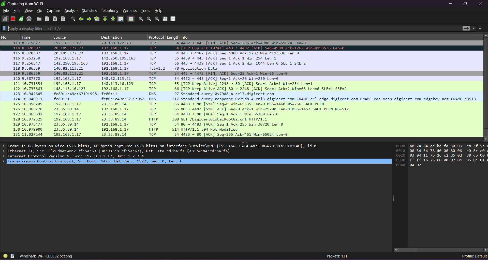
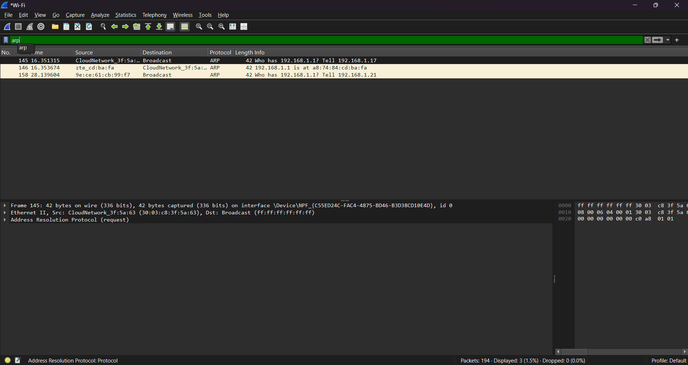
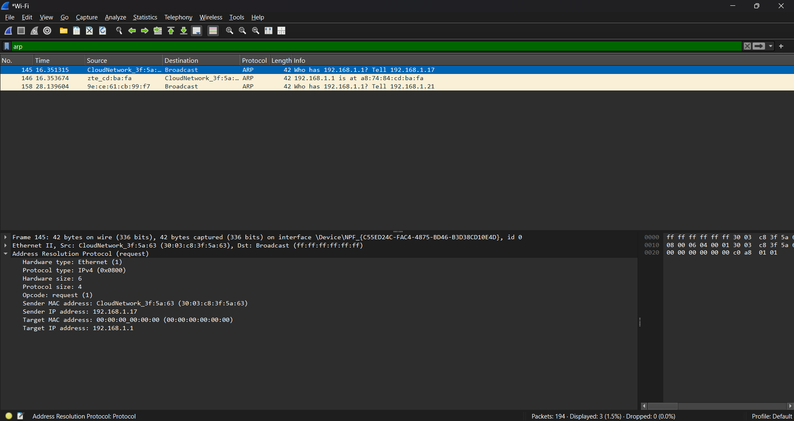
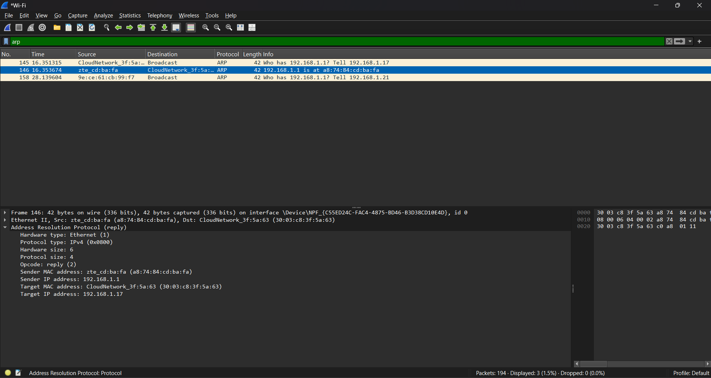


## 2. Using Packet Tracer, simulate an ARP spoofing attack. Analyze the behavior of devices on the network when they receive a malicious ARP response.
```plaintext
In Cisco Packet Tracer, I simulated an ARP spoofing attack and analyzed how devices react to malicious ARP responses. 
I set up a simple network with a 2960 switch, a router, two PCs (PC-0 and PC-1), and an attacking device (PC-2). 
PC-0 and PC-1 were assigned static IP addresses (192.168.1.1 and 192.168.1.2, respectively), while PC-2 (the attacker) was also in the same subnet.
To execute the attack, PC-2 sent a spoofed ARP reply claiming that its MAC address belonged to the router (gateway). 
As a result, PC-0 and PC-1 updated their ARP tables incorrectly, associating the attacker’s MAC address with the router’s IP. 
This allows the attacker to intercept and manipulate traffic between the two legitimate devices.
By monitoring ARP tables using the arp -a command on the victim PCs, 
I observed that the attackers’s MAC address had changed to the gateway’s MAC. 

```
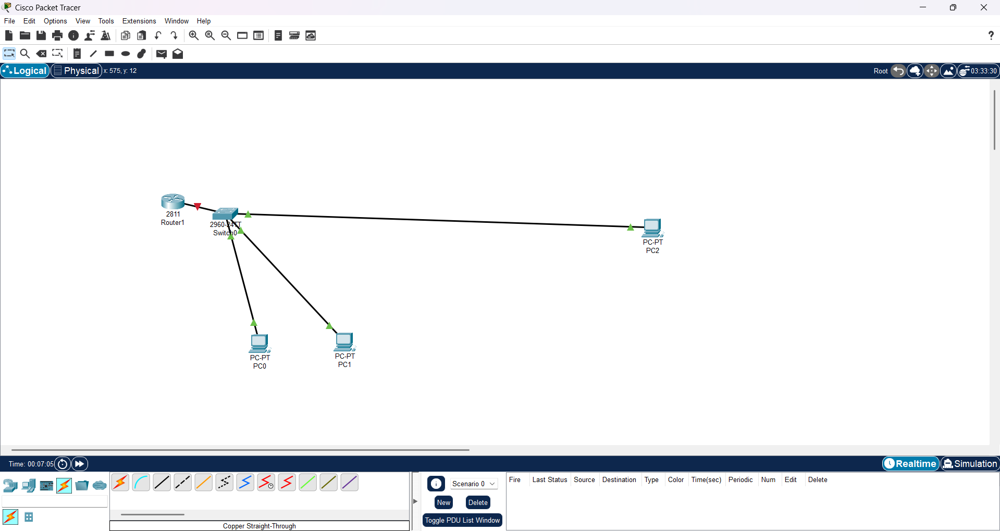
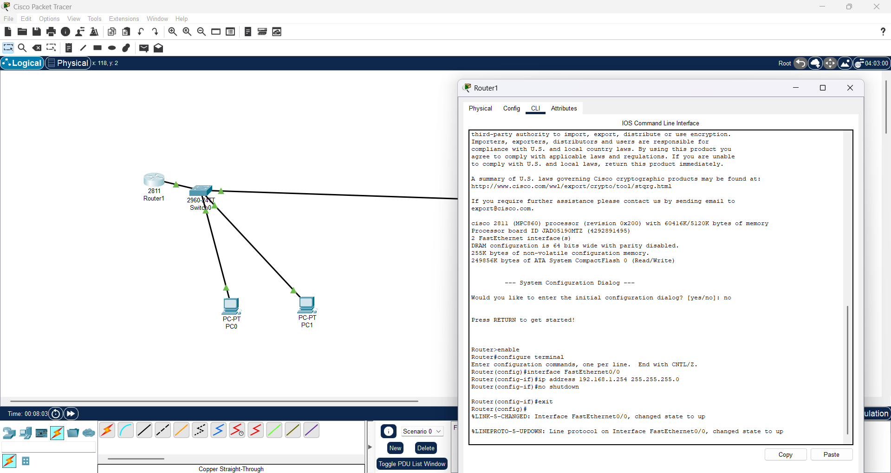
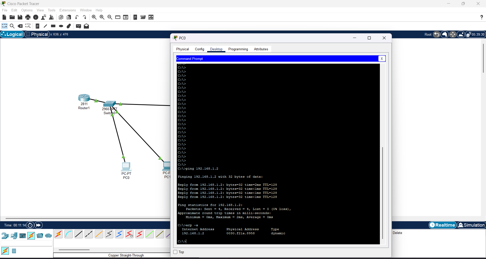
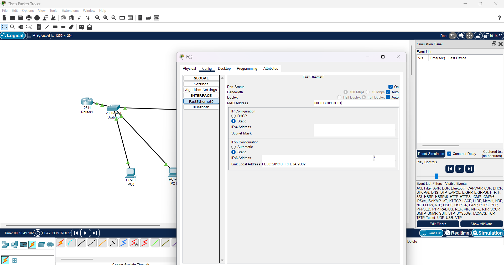
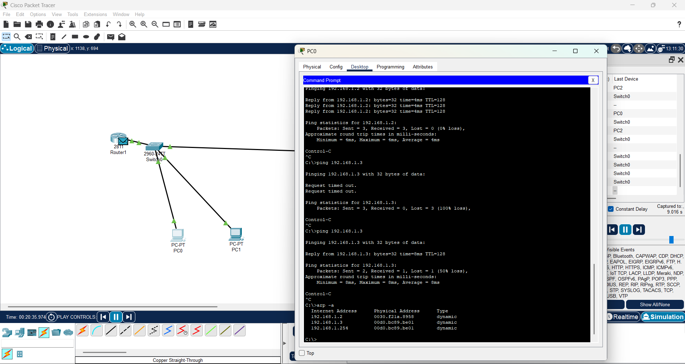

## 3. Manually configure static IPs on the client devices(like Pc or your mobile phone) and verify connectivity using ping.

```plaintext
I manually configured a static IP address on my Linux PC and verified network connectivity using the ping command. 
First, I assigned a static IP using the terminal by running:
sudo ip address add 192.168.56.100/24 dev enp0s3
This set the IP address 192.168.54.100 with a subnet mask of 255.255.255.0 on my Ethernet interface (enp0s3). 
To ensure the changes took effect, I brought the interface up using:
sudo ip link set enp0s3 up
Then, I verified the assigned IP by running:
ip address show enp0s3
To check connectivity, I used the ping command to test communication with another device another PC:
ping 192.168.1.1


```
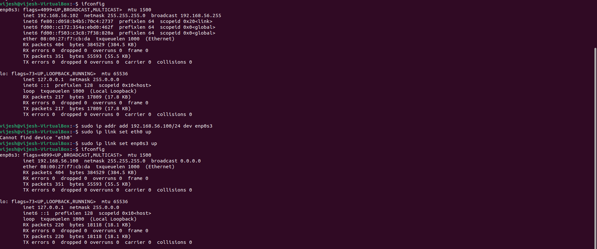

## 4. Use Wireshark to capture DHCP Discover, Offer, Request, and Acknowledge messages and explain the process.

```plaintext
Dynamic Host Configuration Protocol is a network protocol that automatically assigns IP addresses 
and other network configurations such as subnet mask, gateway, and DNS servers to devices in a network, 
eliminating the need for manual configuration. DHCP works through a four-step process known as DORA - Discover, Offer, Request, Acknowledge. 
First, the client sends a DHCP Discover broadcast to find available DHCP servers. 
In response, a server sends a DHCP Offer, proposing an IP address and network details. 
The client then replies with a DHCP Request, confirming its acceptance of the offered address. 
Finally, the server sends a DHCP Acknowledge, officially assigning the IP address and completing the configuration. 
This process ensures efficient IP management, preventing conflicts and simplifying network administration.

```
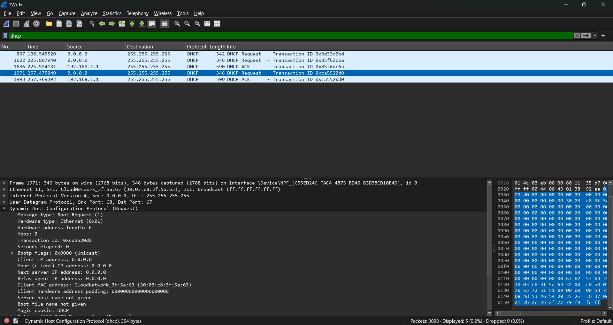
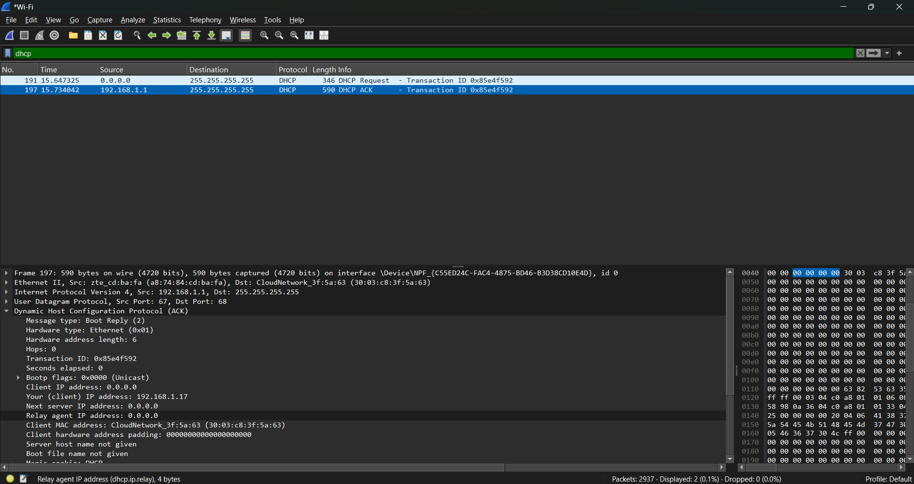


## 5. Given an IP address range of 192.168.1.0/24, divide the network into 4 subnets. Task: Manually calculate the new subnet mask and the range of valid IP addresses for each subnet. Assign IP addresses from these subnets to devices in Cisco Packet Tracer and verify connectivity using ping between them.

```plaintext

The original /24 subnet (255.255.255.0) has 256 total addresses (0-255). 
We need 4 subnets, so we borrow 2 bits from the host portion.
New Subnet Mask: /26 (255.255.255.192) Each subnet has 64 addresses (2⁶ = 64). Usable IPs per subnet: 62 (since 2 are reserved for network ID and broadcast).

Subnet 1: 192.168.1.0/26 → Valid IPs: 192.168.1.1 to 192.168.1.62 (Broadcast: 192.168.1.63)
Subnet 2: 192.168.1.64/26 → Valid IPs: 192.168.1.65 to 192.168.1.126 (Broadcast: 192.168.1.127)
Subnet 3: 192.168.1.128/26 → Valid IPs: 192.168.1.129 to 192.168.1.190 (Broadcast: 192.168.1.191)
Subnet 4: 192.168.1.192/26 → Valid IPs: 192.168.1.193 to 192.168.1.254 (Broadcast: 192.168.1.255)

Implementation in Cisco Packet Tracer:
We need to create four separate LAN segments using switches.
Then we need to Assign static IPs to devices in each subnet. 
Then we can verify connectivity using the ping command. 

```
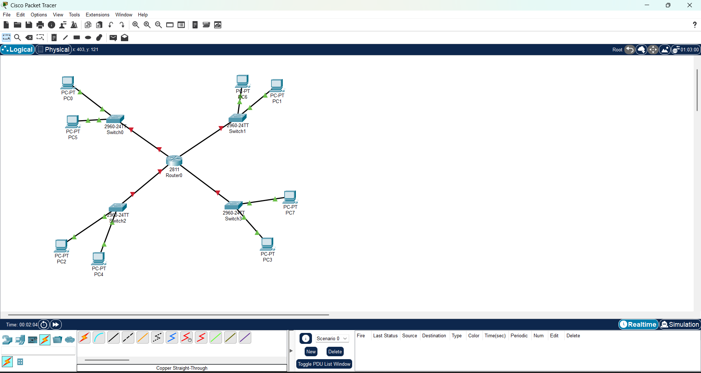

## 6. You are given three IP addresses: 10.1.1.1, 172.16.5.10, and 192.168.1.5. Task: Identify the class of each IP address (Class A, B, or C). What is the default subnet mask for each class? Provide the range of IP addresses for each class.

```plaintext
IP Address Analysis:

10.1.1.1:

Class: A (Range: 1.0.0.0 – 126.255.255.255)
Default Subnet Mask: 255.0.0.0 (/8)
IP Range: 10.0.0.0 – 10.255.255.255

172.16.5.10:

Class: B (Range: 128.0.0.0 – 191.255.255.255)
Default Subnet Mask: 255.255.0.0 (/16)
IP Range: 172.16.0.0 – 172.31.255.255 

192.168.1.5:

Class: C (Range: 192.0.0.0 – 223.255.255.255)
Default Subnet Mask: 255.255.255.0 (/24)
IP Range: 192.168.1.0 – 192.168.1.255 
```

## 7. In Cisco Packet Tracer, create a small network with multiple devices (e.g., 2 PCs and a router). Use private IP addresses (e.g., 192.168.1.x) on the PCs and configure the router to perform NAT to allow the PCs to access the internet. Task: Test the NAT configuration by pinging an external IP address from the PCs and capture the traffic using Wireshark. What is the source IP address before and after NAT?
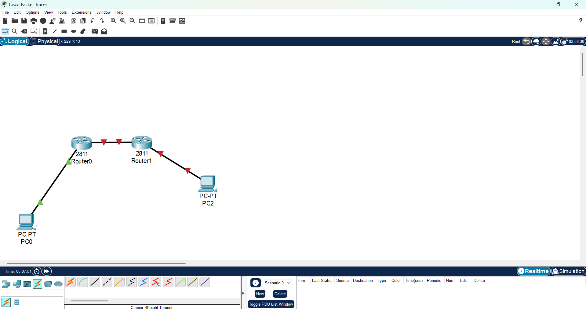

```plaintext
Before NAT: The PC sends packets with a source IP of 192.168.1.10.
After NAT: The router translates the source IP to 200.0.0.1 before sending it to the external network.
This confirms that NAT is working correctly, allowing the PCs to communicate with the Internet while hiding their private IPs.
```