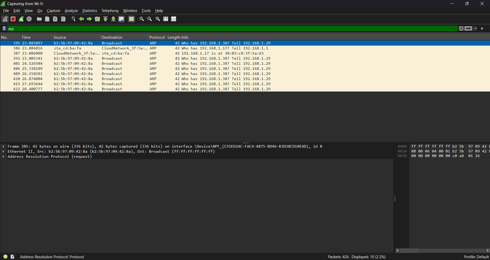
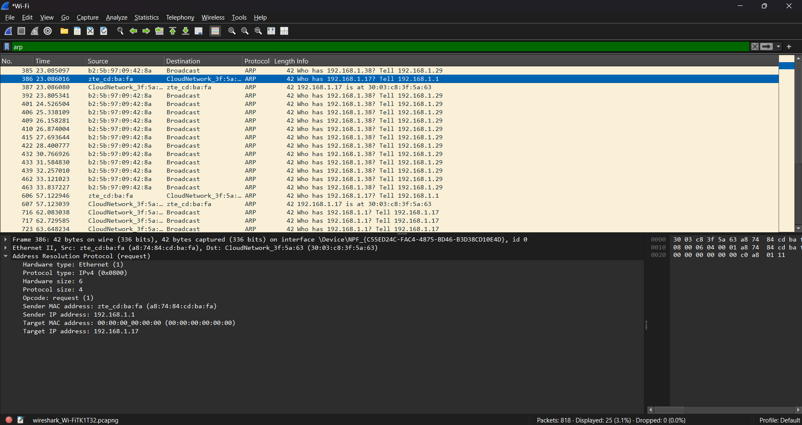
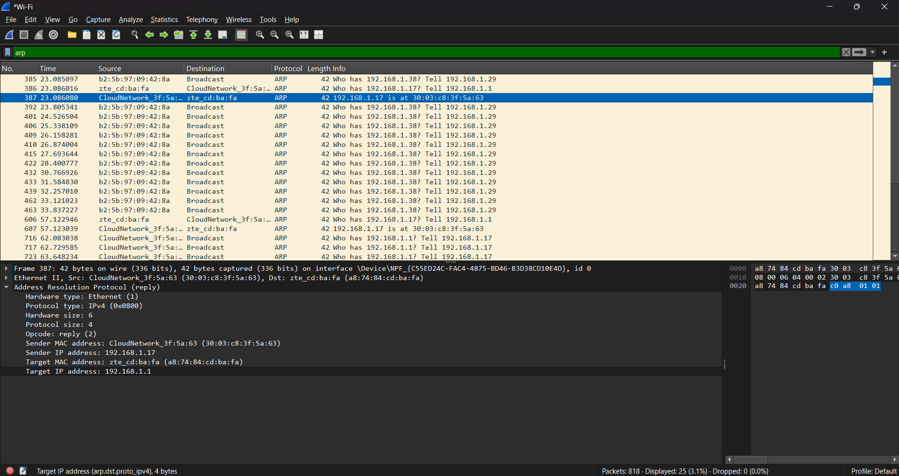
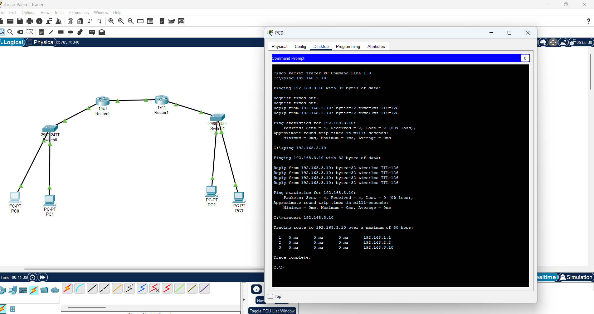
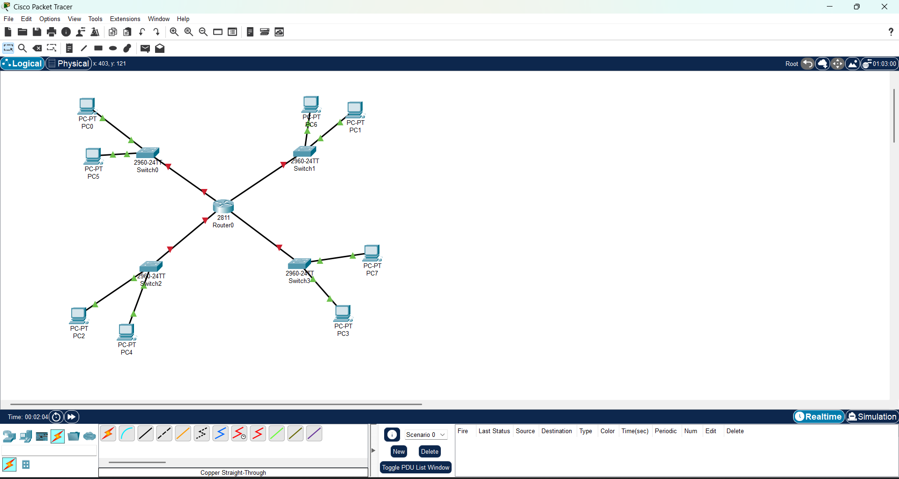
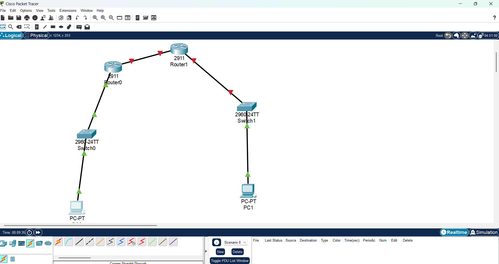

<h1>Networking Training - Module 6 Assignment </h1>

## Q1) Capture and analyze ARP packets using Wireshark. Inspect the ARP request and reply frames when your device attempts to find the router's MAC address.

```plaintext
When analyzing ARP packets using Wireshark, the ARP request frame is sent by a device to 
determine the MAC address corresponding to a known IP address. 
This request is broadcasted to all devices on the local network with 
the destination MAC address set to FF:FF:FF:FF:FF:FF. The ARP request frame 
contains fields such as the sender's MAC and IP address and the target IP address 
whose MAC address is being queried. A request say, "Who has 192.168.1.1? Tell 192.168.1.100", 
indicating that the device with IP 192.168.1.100 is asking for the MAC address of 192.168.1.1. 
In response, the ARP reply frame is sent as a unicast packet from the device owning the requested IP. 
The reply contains the target device’s MAC address, confirming "192.168.1.1 is at 00:1A:2B:3C:4D:5E", 
where 00:1A:2B:3C:4D:5E represents the MAC address of 192.168.1.1. 
This allows the sender to update its ARP cache and establish direct communication using Ethernet frames.


```





### Importance of ARP
```plaintext
The Address Resolution Protocol (ARP) is crucial for packet forwarding in IPv4 networks 
because it enables devices to map IP addresses to MAC addresses, allowing communication over Ethernet and other link-layer protocols. 
When a device wants to send a packet to another device on the same network, it must first determine the recipient's MAC address. 
ARP facilitates this by broadcasting a request for the MAC address associated with a given IP. 
The device owning that IP responds with its MAC address, allowing the sender to forward the packet to the correct destination.
Without ARP, devices would not be able to communicate over Ethernet unless MAC addresses were manually configured. 
Additionally, ARP helps routers forward packets to the next hop in the network by resolving gateway MAC addresses. 
However, ARP is vulnerable to spoofing attacks, where an attacker can send malicious ARP responses to redirect 
traffic, making ARP security mechanisms like Dynamic ARP Inspection (DAI) important in network defense.

```


## Q2) Manually configure static routes on a router to direct packets to different subnets. Use the ip route command and verify connectivity using ping and traceroute.
```plaintext
I have used the below setup in the Cisco Packet tracer and configured the router for static routes. 
Finally I verified using ping and trace route.

```



# Q3) Given a network address of 10.0.0.0/24, divide it into 4 equal subnets.Calculate the new subnet mask.Determine the valid host range for each subnet. Assign IP addresses to devices in Packet Tracer and verify connectivity.

```plaintext
Given Network: 10.0.0.0/24 (Subnet Mask: 255.255.255.0)
We need 4 subnets, so we borrow 2 bits from the host portion.
New Subnet Mask: /26 (255.255.255.192)
Each subnet now has:
64 IPs (2^6)
62 usable host IPs (excluding network and broadcast IPs)

```
```plaintext
Subnet	   Network Address	First Usable IP	Last Usable IP	Broadcast Address
Subnet 1	10.0.0.0/26	    10.0.0.1	    10.0.0.62	   10.0.0.63
Subnet 2	10.0.0.64/26	10.0.0.65	    10.0.0.126	   10.0.0.127
Subnet 3	10.0.0.128/26	10.0.0.129	    10.0.0.190	   10.0.0.191
Subnet 4	10.0.0.192/26	10.0.0.193	    10.0.0.254	   10.0.0.255
```



## Q4) You are given three IP addresses: 192.168.10.5, 172.20.15.1, and 8.8.8.8. Identify the class of each IP address. Determine if it is private or public. Explain how NAT would handle a private IP when accessing the internet.

### Classes and type:
```plaintext
IP Address	    Class	    Private/Public	IP Range for Class
192.168.10.5	Class C	    Private	        192.0.0.0 – 223.255.255.255 
172.20.15.1	    Class B	    Private	        128.0.0.0 – 191.255.255.255 
8.8.8.8	        Class A	    Public	        1.0.0.0 – 126.255.255.255 
```

### Handling private IP by NAT:
```plaintext
Private IP addresses (192.168.10.5 and 172.20.15.1) cannot be routed on the public internet.
Network Address Translation (NAT) allows devices with private IPs to communicate over the internet by converting private IPs into a single public IP address assigned by an ISP.
How NAT Works:
A device with a private IP e.g., 192.168.10.5 sends a request to access a public server e.g., 8.8.8.8.
The router performing NAT replaces the private source IP like 192.168.10.5 with a public IP e.g., 203.0.113.10.
The response from the public server is received by the router.
The router uses a NAT translation table to forward the response back to the correct internal device (192.168.10.5).
```


## Q5) In Cisco Packet Tracer, configure NAT on a router to allow internal devices (192.168.1.x) to access the internet.Test connectivity by pinging an external public IP. Capture the traffic in Wireshark and analyze the source IP before and after NAT translation.


```plaintext

Configure NAT on the Router:
Define an Access Control List (ACL) to allow NAT for internal devices:
access-list 1 permit 192.168.1.0 0.0.0.255
Configure NAT overload (PAT - Port Address Translation):
ip nat inside source list 1 interface GigabitEthernet0/1 overload
Set NAT roles on interfaces:
interface GigabitEthernet0/0
ip nat inside
exit
interface GigabitEthernet0/1
ip nat outside
exit

```


