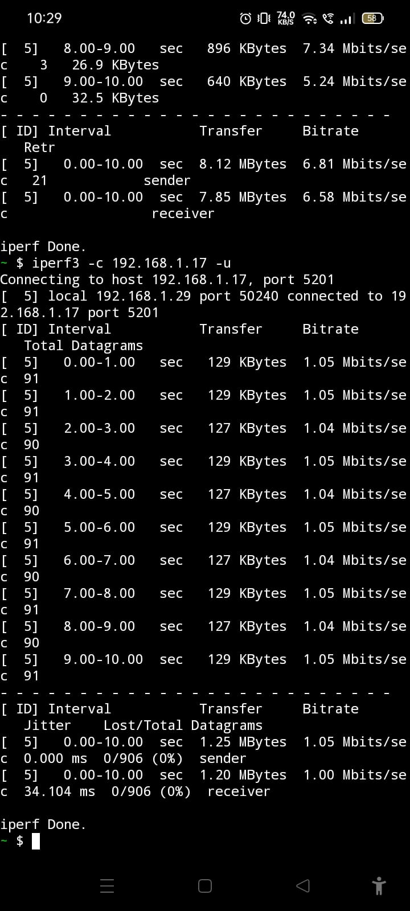
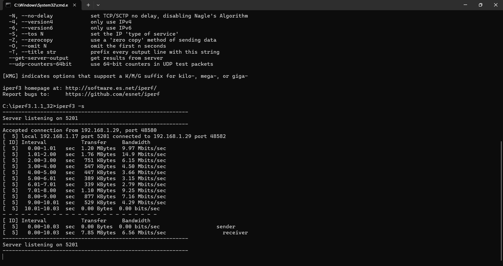
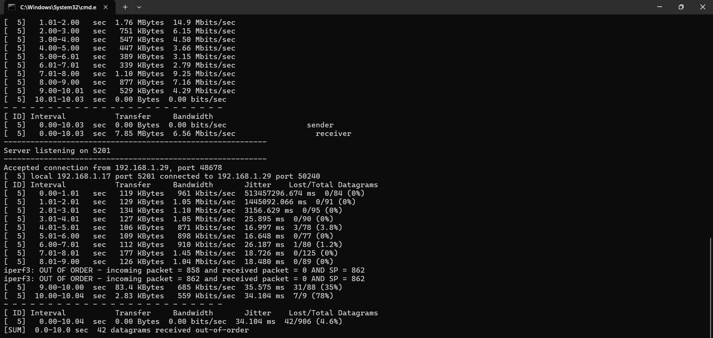

<h1>Networking Training - Module 7 & 8 Assignment </h1>

## Q1) Try Test-Connection and slookup commands for below websites
www.google.com
www.facebook.com
www.amazon.com
www.github.com
www.cisco com

```plaintext
Test-Connection:
Test-Connection www.google.com -Count 4
Test-Connection www.facebook.com -Count 4
Test-Connection www.amazon.com -Count 4
Test-Connection www.github.com -Count 4
Test-Connection www.cisco.com -Count 4
```
```plaintext
nslookup:
nslookup www.google.com
nslookup www.facebook.com
nslookup www.amazon.com
nslookup www.github.com
nslookup www.cisco.com
```


## Q2) Use Wireshark to capture and analyze DNS, TCP, UDP traffic and packet header, packet flow, options and flags

```plaintext
Start Wireshark and Capture Traffic:
Open Wireshark on our computer.
Select the network interface like Wi-Fi or Ethernet to capture packets.
Click "Start Capture" button.
To filter specific traffic, I used:
DNS Filter: dns
TCP Filter: tcp
UDP Filter: udp

```


## Q3) Explore traceroute/tracert for different websites eg:google.com and analyse the parameters in the outout and explore different options for traceroute command

```plaintext
traceroute or tracert (Windows) helps analyze the path packets take to reach a destination, showing each router  hop along the way.

Command:
tracert google.com
tracert facebook.com
tracert amazon.com

Parameters:
Column	                Meaning
Hop Number	        Sequential count of routers the packet passes through.
Response Times (ms)	Three response times for each hop (latency).
IP Address/Hostname	Shows the router’s address or name.
Asterisks (*)	    Indicates a request timeout (packet lost or ICMP blocked).


Options:
Set Max Hops:
tracert -h 15 google.com

Use IPv6 Instead of IPv4:
tracert -6 google.com

Specify Timeout:
tracert -w 500 google.com
```


## Q4 - Q14) Use Cisco packet tracer for the below
Set up trunk ports between switches and try ping between different VLANs.
Change the native VLAN on a trunk port. Test for VLAN mismatches and
troubleshoot.
Configure a management VLAN and assign an IP address for remote
access. Test SSH or Telnet access to the switch.
You have a Cisco switch and a VolP phone that needs to be placed in a voice
VLAN (VLAN 20). The data for the PC should remain in a separate VLAN (VLAN
10). Configure the switch port to support both voice and data traffic.
You configured VLANs 10 and 20 on your switch and assigned ports to each
VLAN. However, devices in VLAN 10 cannot communicate with devices in VLAN
20. Troubleshoot the issue.
Try Inter VLAN routing with Router
Implement ACLs to restrict traffic based on source and destination ports. Test
rules by simulating legitimate and unauthorized traffic.
Configure a standard Access Control List (ACL) on a router to permit traffic from
a specific IP range. Test connectivity to verify the ACL is working as intended.
Create an extended ACL to block specific applications, such as HTTP or FTP
traffic. Test the ACL rules by attempting to access blocked services.
Try Static NAT, Dynamic NAT and PAT to translate IPs


## Q15) How to Download iperf in laptop/phone and make sure they are in same network. Try different iperf commands with tcp, udp, birectional, reverse, multicast, parallel options and analyze the bandwidth and rate of transmission, delay, jitter etc.

```plaintext
On Windows:

Download the iperf executable from the official website: iperf.fr.
Extract the files and add the iperf.exe path to your system's environment variables for easy access.

On Android:

Download the Termux app from the Google Play Store.
In Termux, install iperf:
pkg install iperf3


Start iperf Server on Windows:
iperf3 -s


```
### Mobile Client:




### Windows Server:




