<h1>Networking Training - Module 3 & 4 Assignment </h1>


## 1. Simulate a small network with switches and multiple devices. Use ping to generate traffic and observe the MAC address table of the switch. Capture packets using Wireshark to analyze Ethernet frames and MAC addressing.
```plaintext
I used Cisco Packet Tracer to simulate a small network with a 2960 series switch and four PCs.

First, I added the switch and four end devices PC-0, PC-1, PC-2, and PC-3 to the workspace. Then, I connected each PC to the switch using Copper Straight-Through cables. Next, I assigned static IP addresses to each PC to ensure they could communicate:

PC-0: 192.168.1.1
PC-1: 192.168.1.2
PC-2: 192.168.1.3
PC-3: 192.168.1.4


Once the setup was complete, I tested network connectivity by using the ping command from PC-0 to PC-1, PC-2, and PC-3. The pings were successful, confirming that the devices could communicate.
After verifying connectivity, I accessed the switch’s Command Line Interface and used the command "show mac address-table" to view the MAC address table.
This command displayed the learned MAC addresses and their corresponding ports.

Then, I switched to Simulation Mode and enabled ICMP filtering to observe how packets were being transmitted. I then initiated a ping from PC-0 to PC-1, allowing me to capture and inspect the packets step by step.

By clicking on the captured packets, I examined key details such as Source MAC Address, Destination MAC Address and Payload like ICMP Request & Reply.


```

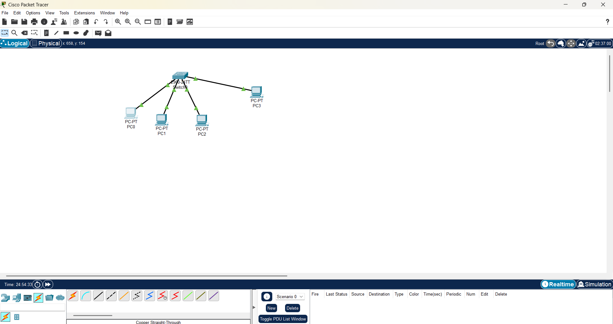
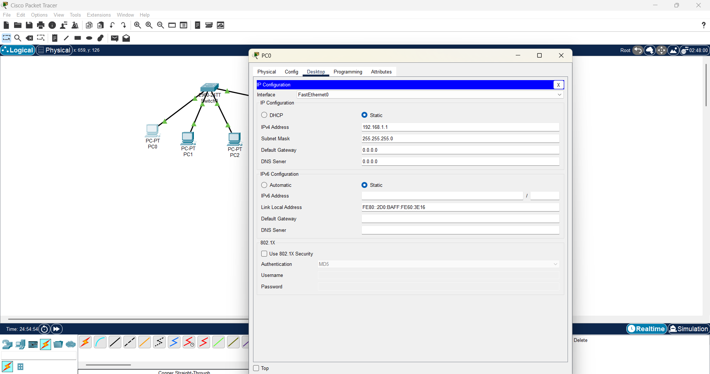
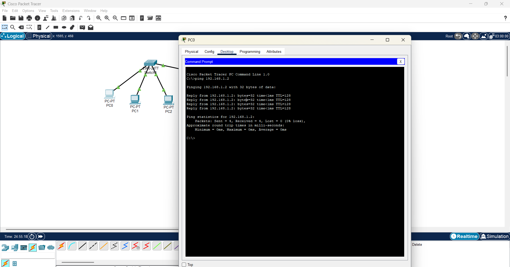
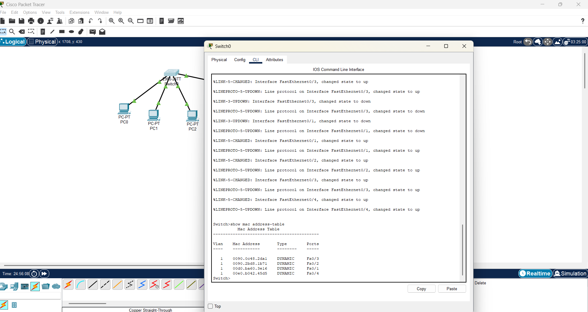
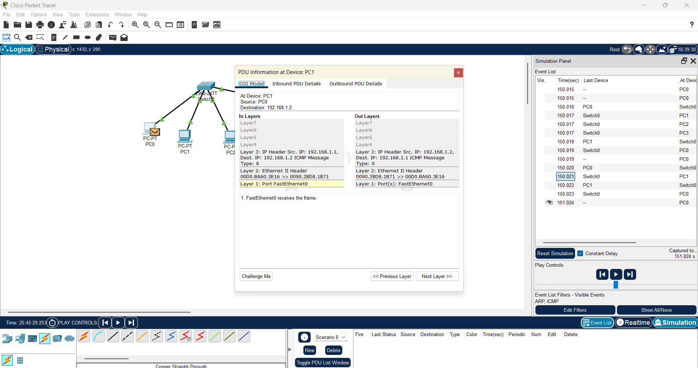


## 2. Capture and analyze Ethernet frames using Wireshark. Inspect the structure of the frame, including destination and source MAC addresses, Ethertype, payload, and FCS. Use GNS3 or Packet Tracer to simulate network traffic.
```plaintext
I used Cisco Packet Tracer to simulate a small network with a 2960 series switch and four PCs.
The connections are similar to the answer for question 1.

PC-0: 192.168.1.1
PC-1: 192.168.1.2
PC-2: 192.168.1.3
PC-3: 192.168.1.4

Once the setup was complete, I switched to Simulation Mode and enabled ICMP filtering to observe how packets were being transmitted. I then initiated a ping from PC-0 to PC-1, allowing me to capture and inspect the packets step by step.

After capturing the ICMP packet, the Ethernet frame contained Destination MAC Address, Source MAC Address, Ethertype: 0x0800 (indicating an IPv4 packet) and Payload ICMP Echo Request (ping message).
```

.png)
.png)
.png)
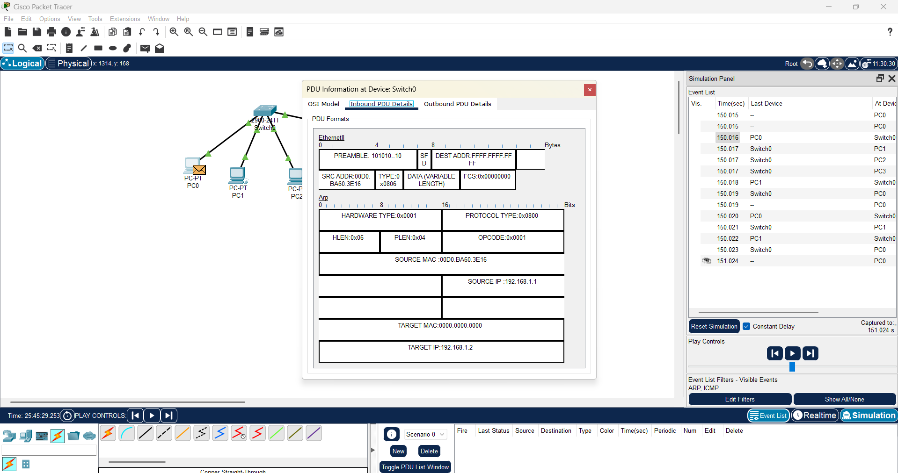
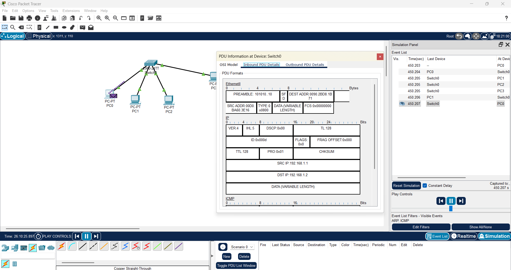

## 3. Configure static IP addresses, modify MAC addresses, and verify network connectivity using ping and ifconfig commands.
```plaintext
To setting up a Static IP Address, we need to give our Linux machine an IP for the specific interface. My interface is enp0s3. 

sudo ip addr add 192.168.1.100/24 dev enp0s3

This assigns 192.168.1.100 to our eth0 network interface. The /24 means the subnet mask is 255.255.255.0.

Now, we need to bring the network interface up:
sudo ip link set eth0 up

Then check if the ip has been changed or not using the ifconfig command.

MAC:
Now, we can modify the MAC address.

First, shut the interface down:
sudo ip link set eth0 down

Then change the MAC address to 00:1A:2B:3C:4D:5E:
sudo ip link set eth0 address 00:1A:2B:3C:4D:5E

Finally, bring the interface back up:
sudo ip link set eth0 up

To check if it worked, run:
ip link show eth0

```


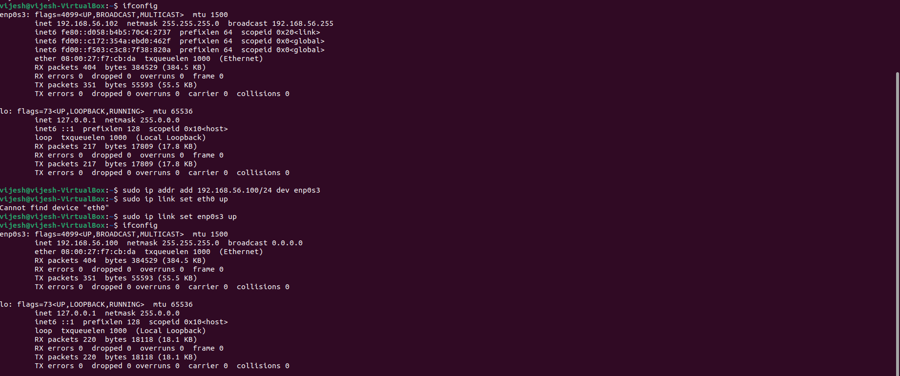
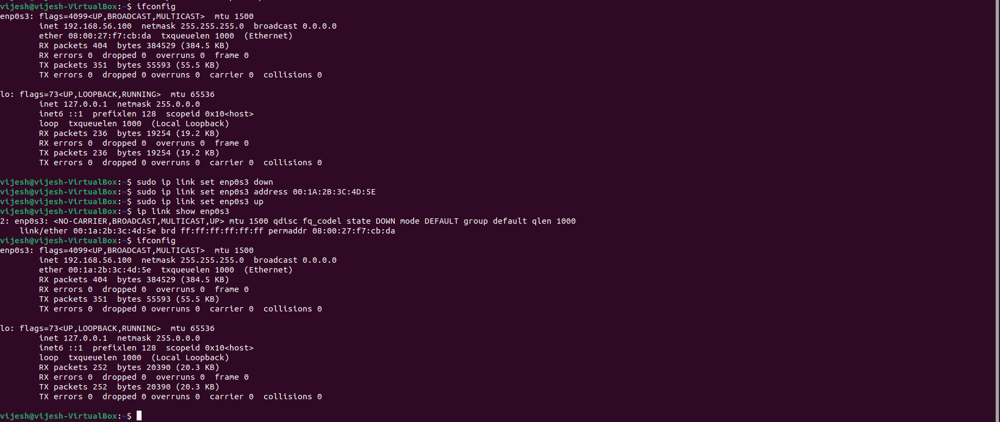
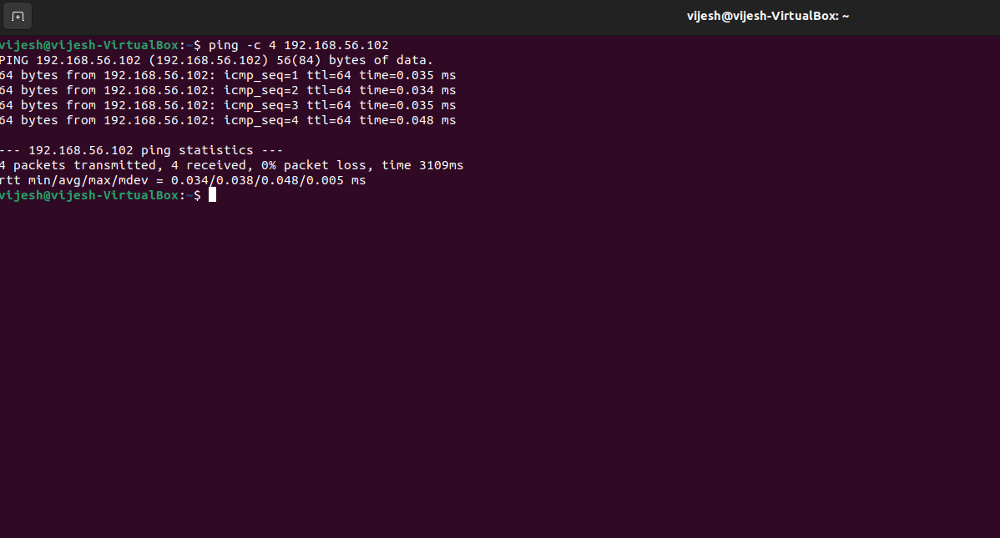

## 4-7.Troubleshoot Ethernet Communication with ping and traceroute -> Using cisco packet tracer: • Create a simple LAN setup with two Linux machines connected via a switch. • Ping from one machine to the other. If it fails, use ifconfig to ensure the IP addresses are configured correctly. • Use traceroute to identify where the packets are being dropped if the ping fails.:
```plaintext 
In Cisco Packet Tracer, I set up a simple LAN by connecting two PCs PC-0 and PC-1 to a 2960 switch using Copper Straight-Through cables. Then I assigned static IPs 192.168.1.10 for PC-0 and 192.168.1.20 for PC-1. Then I tested connectivity by pinging PC-1 from PC-0 (ping 192.168.1.20). I checked the ARP table with arp -a, which showed the MAC address, meaning both PCs could communicate. Finally, I used tracert 192.168.1.20 on PC0, and it showed a direct connection in one hop, proving that my network setup was working correctly.

```
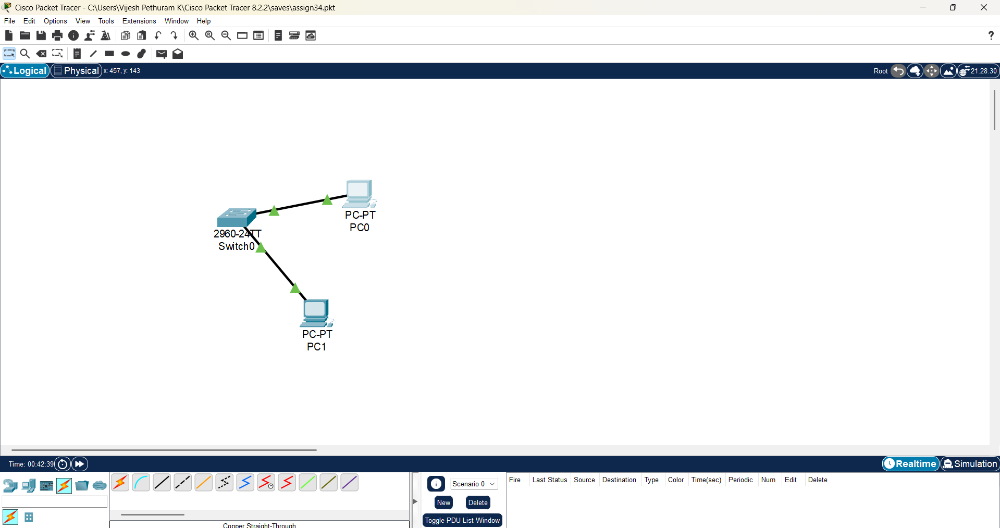
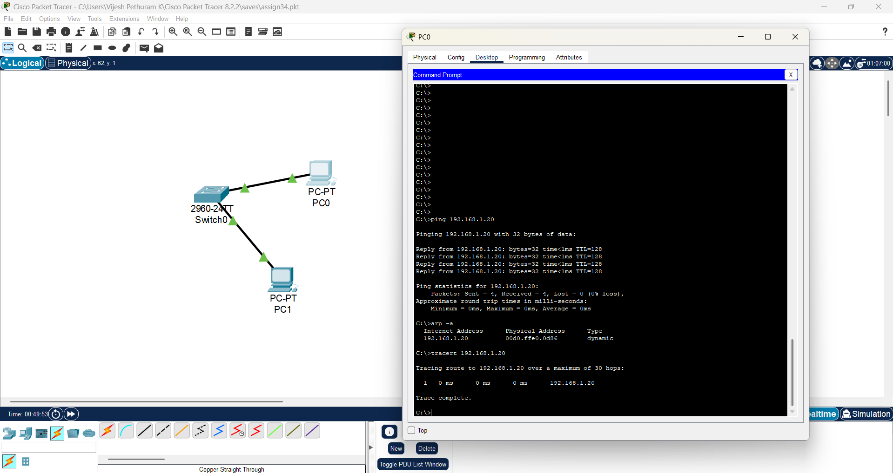

## 8.Research the Linux kernel's handling of Ethernet devices and network interfaces. Write a short report on how the Linux kernel supports Ethernet communication (referencing kernel.org documentation).:
```plaintext 
The Linux kernel supports Ethernet communication through its robust networking stack, which manages network interfaces, packet transmission, and device drivers. The netdev subsystem handles Ethernet devices, allowing seamless communication between software and hardware. Ethernet device drivers enable network interface cards (NICs) to transmit and receive packets, while the kernel’s network stack processes Ethernet frames using a layered approach—from user space system calls (send(), recv()) to kernel space processing via the socket API, protocol stack (TCP/IP, UDP), and network drivers. The kernel also supports virtual network interfaces (veth, bridge, bonding) alongside physical ones. Network interfaces are managed using tools like ip and ifconfig, allowing users to configure and monitor connectivity. The ip command is commonly used for configuration, where ip address add 192.168.1.10/24 dev eth0 assigns an IP, and ip link set eth0 up activates the interface.
```
## 9.Describe how you would configure a basic LAN interface using the ip command in Linux (kernel.org).
```plaintext
To configure a basic LAN interface in Linux, the ip command is a versatile tool that allows for detailed network interface management.
Assign an IP Address: To set a static IP address for the interface, execute:
sudo ip address add 192.168.1.10/24 dev enp0s3
This command assigns the IP address 192.168.1.10 with a subnet mask of 255.255.255.0 to eth0. 
After assigning the IP address, bring the interface up:
sudo ip link set eth0 up
```


## 10.Use Linux to view the MAC address table of a switch (if using a Linux-based network switch). Use the bridge or ip link commands to inspect the MAC table and demonstrate a basic switch's operation.
```plaintext
sudo bridge fdb show command displays the MAC address forwarding table, mapping MAC addresses to the enp0s3 network interface. These entries guide the system in directing packets to their correct destinations. Meanwhile, the ip link show command lists all available network interfaces, including the loopback (lo) and Ethernet (enp0s3). The enp0s3 interface is in an active (UP) state, supports broadcasting and multicasting. This confirms that the interface is operational and ready for network communication.
```
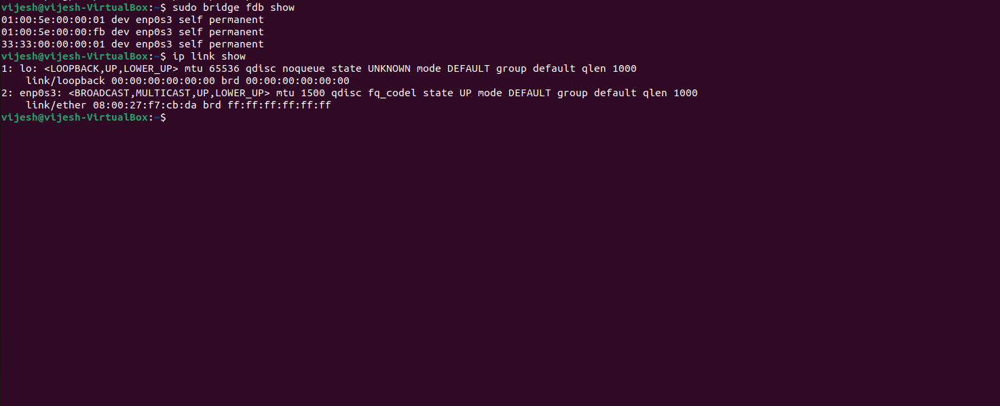
